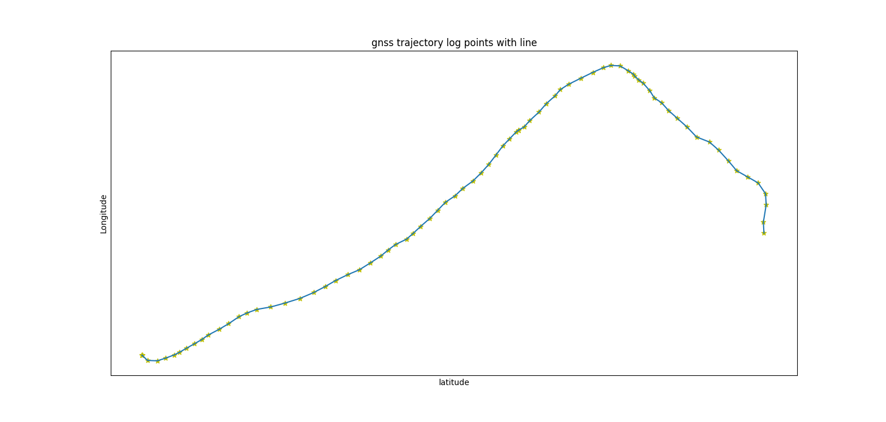

# gnss_trajectory

**This package draws trajectory from log of gnss**

## Requirement
+ python3 (3.6.9)
+ matplotlib (3.2.2)

## Set Up
Download `gnss_trajectory` package.

```shell
$ cd ~/
$ git clone https://github.com/HHorimoto/gnss_trajectory.git
```

## How To Use

1. Place your log file (**NMEA**) directly under the `log` directory and see it. Here is one of the example.

```shell
$ cd ~/gnss_trajectory/log
$ ls | grep .log
gps_r0_20221011_072000.log
gps_r1_20221011_072000.log
```

2. Run `run.py` to plot trajectory.

```shell
$ cd ~/gnss_trajectory
$ python3 run.py ./log/your.log
```

3. The scripts shows the plot image like below.

